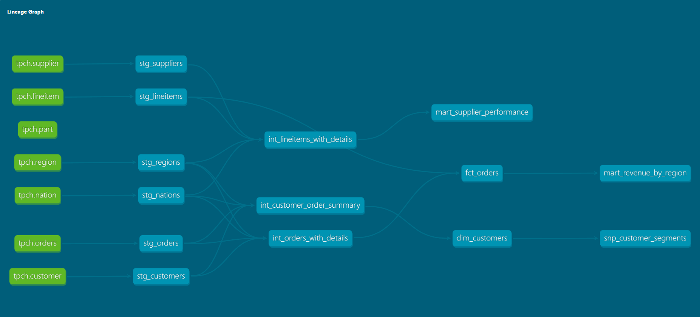

# E-commerce Analytics — dbt + Snowflake

A production-grade dbt project modelling e-commerce sales data
built on the Snowflake TPC-H sample dataset. Demonstrates
real-world data engineering patterns including layered
architecture, incremental models, SCD2 snapshots, reusable
macros, and dev/prod environment separation.

---

## Lineage Graph



---

## Project Structure
models/
├── staging/          # 1-to-1 with source tables, light cleanup only
├── intermediate/     # Business logic, joins, aggregations
└── marts/            # Final analytics-ready tables for BI tools
snapshots/            # SCD2 tracking for slowly changing dimensions
macros/               # Reusable SQL functions (DRY principle)

## Data Sources

Raw data comes from Snowflake's built-in **TPC-H sample dataset**,
which simulates a real e-commerce transactional database with
orders, customers, line items, suppliers, and geography tables.

| Source Table | Description |
|---|---|
| `orders` | One row per customer order |
| `lineitem` | Most granular table — one row per item per order |
| `customer` | Customer master data |
| `supplier` | Supplier master data |
| `nation / region` | Geography reference tables |

---

## Models

### Staging (6 models)
Light cleanup only — renaming columns, casting types. No joins.

### Intermediate (3 models)
| Model | Description |
|---|---|
| `int_orders_with_details` | Orders enriched with customer and geography |
| `int_lineitems_with_details` | Line items enriched with supplier and geography |
| `int_customer_order_summary` | Order history aggregated per customer |

### Marts (4 models)
| Model | Materialization | Rows | Description |
|---|---|---|---|
| `fct_orders` | Incremental table | ~1.5M | Core sales fact table |
| `dim_customers` | Table | ~150K | Customer dimension with RFM segmentation |
| `mart_revenue_by_region` | Table | ~2K | Monthly revenue by region and nation |
| `mart_supplier_performance` | Table | ~10K | Supplier metrics with surrogate keys |

### Snapshots (1)
| Snapshot | Strategy | Description |
|---|---|---|
| `snp_customer_segments` | check | Tracks customer segment changes over time (SCD2) |

---

## Advanced Features

### Incremental Models
`fct_orders` uses incremental materialization — on each run it
only processes orders newer than the latest date already in the
table. Reduces compute cost significantly on large datasets.

### Macros
| Macro | Purpose |
|---|---|
| `cents_to_dollars` | Converts raw price values to formatted dollar amounts |
| `safe_divide` | Division that returns null instead of crashing on zero |
| `generate_surrogate_key` | Creates MD5 hash keys from multiple columns |
| `generate_schema_name` | Controls schema naming across environments |

### Snapshots (SCD2)
`snp_customer_segments` captures a historical record every time
a customer's segment, spend tier, or frequency tier changes.
Enables time-based analysis like "what was this customer's
segment 6 months ago?"

### Dev / Prod Environments
| Environment | Database | Purpose |
|---|---|---|
| `dev` | `DBT_DEV` | Local development and testing |
| `prod` | `DBT_PROD` | Stable, business-facing data |

Schema separation per layer (staging / intermediate / marts)
in both environments.

---

## Data Tests
32 automated tests covering:
- Uniqueness and not-null constraints on all primary keys
- Accepted values for status and segment columns
- Referential integrity across layers

---

## Setup

### Prerequisites
- Python 3.8+
- Snowflake account (free trial works)
- Git

### Installation
```bash
# Clone the repo
git clone https://github.com/<your-username>/ecommerce-analytics-dbt.git
cd ecommerce-analytics-dbt

# Create and activate virtual environment
python -m venv venv
venv\Scripts\activate      # Windows
source venv/bin/activate   # Mac/Linux

# Install dependencies
pip install dbt-snowflake
```

### Configure Snowflake connection
Create `~/.dbt/profiles.yml` with your Snowflake credentials.
See [profiles.yml.example](profiles.yml.example) for the
required structure.

### Run the project
```bash
dbt debug          # test connection
dbt run            # build all models in dev
dbt test           # run all 32 data quality tests
dbt docs generate  # generate documentation
dbt docs serve     # view lineage graph locally
```

---

## Tech Stack
- **dbt Core** 1.11
- **Snowflake** (free trial)
- **Python** 3.8+

---

## Business Questions Answered
- Which regions and nations generate the most revenue?
- Who are our highest-value customers and how are they segmented?
- What is the monthly order fulfillment rate by region?
- Which suppliers drive the most net revenue?
- How long does it take to ship orders on average?
- How have customer segments changed over time?
